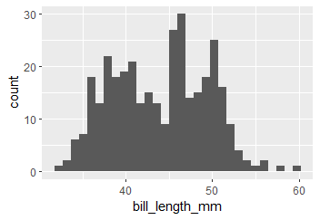

```{r setup, include=FALSE}
knitr::opts_chunk$set(echo = TRUE, message = FALSE, warning = FALSE)

library(tidyverse)
```

# Abstract

This is my abstract.....

# Introduction

Enter intro text here

# Methods

We used the `car` package to test for equal variances.

# Results

```{r}
library(palmerpenguins)

data("penguins")
```

State some results (P = 0.12, Figure 1).

```{r}
# test for equal variances


# conduct appropriate t-test
```

```{r}
ggplot(penguins)+
  geom_histogram(aes(x = bill_length_mm))
```



**Figure 1.** Histogram of bill length

# References

1.  Albert, C. H., Rayfield, B., Dumitru, M., & Gonzalez, A. (2017). Applying network theory to prioritize multispecies habitat networks that are robust to climate and land-use change: Prioritizing a network for biodiversity. *Conservation Biology*, *31*(6), 1383--1396. <https://doi.org/10.1111/cobi.12943>
